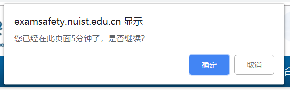
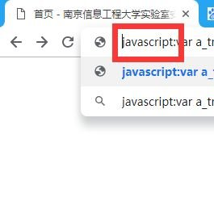
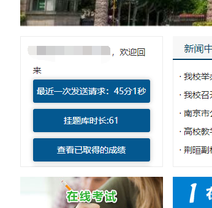

## 这是什么？

学校要求 所有院的学生 完成 该新网站上的题库考试，<br/>考试前 根据不同院要求 必须强制至少学习若干小时。

- *2018年11月要求所有人学习1或6小时*
- *2019年10月要求所有人学习8小时*

“学习”时每 5min 会弹一次窗，如果不点击确认将无法继续计时。



如此看来，1 小时就需要每隔 5min 点击 12 次，6 小时则需要每隔 5min 点击 72 次。

为了节约精力，遂提供了一种解决掉无聊的弹窗的另一种方法。

## 思路

### 思路 1

重写浏览器的 `windows.confirm` 代码，使其自动确认以关闭弹窗即可。

```javascript
(function(){"use strict";let w=window.confirm;window.confirm=function(...args){if(args[0].indexOf("5分钟")>=0){return true}else{return w(...args)}}})();
```

### 思路 2 ⭐

打开 F12 开发者控制台分析统计时长的原理。

最终发现，浏览器会携带一个身份 cookie 每 1min 无参轮询 一个心跳接口。

## 代码

```javascript
(function(){"use strict";const h=prompt("请输入你需要挂的小时数目(默认为8)","8");let a_tm=0;setInterval(function(){a_tm%60==0?$.post("/exam_xuexi_online.php",{cmd:"xuexi_online"},function(n){n=JSON.parse(n),!n.shichang&&alert("未登录或系统错误"),$(".block-login .explanation li:first").html("<a class='changePassword loginCommonBtn'>最近一次发送请求:"+n.shichang+"</a>"),-1!=n.shichang.indexOf(`${h}时`)&&alert("挂完了"),console.log(n.shichang)}):$(".block-login .explanation li:eq(1)").html("<a class='changePassword loginCommonBtn'>挂题库时长:"+a_tm+"</a>"),a_tm++},1e3)})();
```

## 使用方法

使用本代码需要打开 [http://examsafety.nuist.edu.cn](http://examsafety.nuist.edu.cn) 首页

请先复制本文以上代码

### 使用方法1

F12打开开发者控制台 点击console选项卡 粘贴后回车即可运行

### 使用方法2

安装 类似 油猴的浏览器拓展

### 使用方法3

把代码前加上`javascript:`后粘贴在URL地址栏中即可



## 最终效果图


